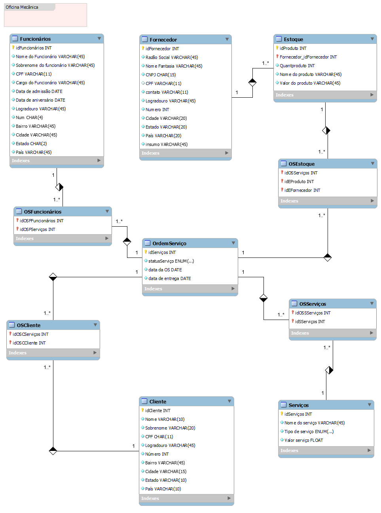

# Construa Banco de Dados do Zero SQL

## Introdução
O projeto consistiu na criação de um banco de dados relacional para o cenário de uma oficina mecânica. O banco de dados **Oficina_Mecanica** foi projetado para gerenciar as operações de uma oficina mecânica, incluindo o cadastro de clientes, funcionários, serviços, fornecedores, estoque de peças, ordens de serviço e pagamentos. Esta documentação descreve o esquema do banco de dados, detalhando as tabelas, suas respectivas colunas, chaves primárias, chaves estrangeiras e restrições aplicadas. Para validação do projeto foram persistidos um volume de dados, de forma a possibilitar a extração de informações utilizando queries em SQL.

---

## Diagrama de Relacionamento

O diagrama abaixo apresenta a estrutura de relacionamento entre as principais tabelas do banco de dados **Oficina_Mecanica**. As chaves primárias e estrangeiras estão destacadas, mostrando como as tabelas se interconectam para garantir a integridade dos dados e facilitar o gerenciamento das operações da oficina.



### Descrição do Diagrama

- A tabela principal `ordem_servico` centraliza o fluxo de informações, conectando-se com outras tabelas fundamentais, como `cliente`, `funcionario`, `servico`, `estoque` e `pagamento`.
- O relacionamento entre `cliente` e `ordem_servico` é de um para muitos, onde um cliente pode ter várias ordens de serviço.
- A tabela `funcionario` registra os responsáveis por executar as ordens de serviço.
- A tabela `servico` descreve os serviços prestados, que são associados às ordens de serviço.
- O estoque de peças utilizadas em cada ordem de serviço é gerenciado pela tabela `estoque`.
- Por fim, os pagamentos relacionados às ordens de serviço são registrados na tabela `pagamento`.

Este diagrama ajuda a visualizar como os dados fluem dentro do banco de dados e como as tabelas se relacionam para garantir que todas as informações sejam armazenadas de maneira consistente e acessível.

---

## 1. Tabela: `cliente`

Tabela que armazena informações dos clientes da oficina.

**Colunas:**

- `id_cliente` (INT, PK, AUTO\_INCREMENT) - Identificador único do cliente.
- `nome` (VARCHAR(50), NOT NULL) - Nome completo do cliente.
- `cpf` (CHAR(11), NOT NULL, UNIQUE) - Cadastro de Pessoa Física.
- `endereco` (VARCHAR(100)) - Endereço completo.
- `telefone` (VARCHAR(15)) - Número de contato.

**Restrições:**

- `unique_cpf_cliente` - Garante que o CPF seja único.

**Exemplo de Uso:**

```sql
INSERT INTO cliente (nome, cpf, endereco, telefone) VALUES ('João Silva', '12345678901', 'Rua A, 123', '(11) 98765-4321');
```

---

## 2. Tabela: `funcionario`

Tabela que armazena informações sobre os funcionários da oficina.

**Colunas:**

- `id_funcionario` (INT, PK, AUTO\_INCREMENT) - Identificador único do funcionário.
- `nome` (VARCHAR(50), NOT NULL) - Nome completo do funcionário.
- `cpf` (CHAR(11), NOT NULL, UNIQUE) - Cadastro de Pessoa Física.
- `funcao` (VARCHAR(30)) - Cargo ou função desempenhada.
- `telefone` (VARCHAR(15)) - Número de contato.

**Restrições:**

- `unique_cpf_funcionario` - Garante que o CPF seja único.

**Exemplo de Uso:**

```sql
INSERT INTO funcionario (nome, cpf, funcao, telefone) VALUES ('Carlos Souza', '98765432100', 'Mecânico', '(11) 91234-5678');
```

---

## 3. Tabela: `servico`

Tabela que armazena os serviços oferecidos pela oficina.

**Colunas:**

- `id_servico` (INT, PK, AUTO\_INCREMENT) - Identificador único do serviço.
- `descricao` (VARCHAR(100), NOT NULL) - Descrição do serviço.
- `valor` (DECIMAL(10,2)) - Preço do serviço.

**Exemplo de Uso:**

```sql
INSERT INTO servico (descricao, valor) VALUES ('Troca de óleo', 150.00);
```

---

## 4. Tabela: `fornecedor`

Tabela que armazena informações sobre os fornecedores de peças e materiais.

**Colunas:**

- `id_fornecedor` (INT, PK, AUTO\_INCREMENT) - Identificador único do fornecedor.
- `nome` (VARCHAR(50), NOT NULL) - Nome do fornecedor.
- `cnpj` (CHAR(14), NOT NULL, UNIQUE) - Cadastro Nacional de Pessoa Jurídica.
- `contato` (VARCHAR(15)) - Telefone de contato.

**Restrições:**

- `unique_cnpj_fornecedor` - Garante que o CNPJ seja único.

**Exemplo de Uso:**

```sql
INSERT INTO fornecedor (nome, cnpj, contato) VALUES ('Auto Peças Ltda', '12345678000100', '(11) 3344-5566');
```

---

## 5. Tabela: `estoque`

Tabela que armazena informações sobre o estoque de peças e materiais.

**Colunas:**

- `id_produto` (INT, PK, AUTO\_INCREMENT) - Identificador único do produto.
- `descricao` (VARCHAR(100), NOT NULL) - Descrição do produto.
- `quantidade` (INT, NOT NULL) - Quantidade disponível em estoque.
- `valor_unitario` (DECIMAL(10,2)) - Preço unitário do produto.
- `id_fornecedor` (INT, FK) - Chave estrangeira para a tabela `fornecedor`.

**Restrições:**

- `fk_estoque_fornecedor` - Chave estrangeira que referencia `id_fornecedor` na tabela `fornecedor`.

**Exemplo de Uso:**

```sql
INSERT INTO estoque (descricao, quantidade, valor_unitario, id_fornecedor) VALUES ('Pneu Aro 15', 50, 250.00, 1);
```

---

## 6. Tabela: `ordem_servico`

Tabela que armazena as ordens de serviço realizadas na oficina.

**Colunas:**

- `id_os` (INT, PK, AUTO\_INCREMENT) - Identificador único da ordem de serviço.
- `data_criacao` (DATE, NOT NULL) - Data de criação da ordem de serviço.
- `status` (ENUM('Em análise', 'Em execução', 'Concluído'), NOT NULL) - Status atual da ordem de serviço.
- `id_cliente` (INT, FK) - Chave estrangeira para a tabela `cliente`.
- `id_funcionario` (INT, FK) - Chave estrangeira para a tabela `funcionario`.
- `id_servico` (INT, FK) - Chave estrangeira para a tabela `servico`.

**Restrições:**

- `fk_os_cliente` - Chave estrangeira que referencia `id_cliente` na tabela `cliente`.
- `fk_os_funcionario` - Chave estrangeira que referencia `id_funcionario` na tabela `funcionario`.
- `fk_os_servico` - Chave estrangeira que referencia `id_servico` na tabela `servico`.

**Exemplo de Uso:**

```sql
INSERT INTO ordem_servico (data_criacao, status, id_cliente, id_funcionario, id_servico) VALUES ('2024-10-20', 'Em análise', 1, 1, 1);
```

---

## 7. Tabela: `pagamento`

Tabela que armazena informações sobre os pagamentos relacionados às ordens de serviço.

**Colunas:**

- `id_pagamento` (INT, PK, AUTO\_INCREMENT) - Identificador único do pagamento.
- `data_pagamento` (DATE, NOT NULL) - Data em que o pagamento foi realizado.
- `valor` (DECIMAL(10,2), NOT NULL) - Valor do pagamento.
- `metodo_pagamento` (ENUM('Dinheiro', 'Cartão de Crédito', 'Cartão de Débito', 'Transferência'), NOT NULL) - Método utilizado para o pagamento.
- `id_os` (INT, FK) - Chave estrangeira para a tabela `ordem_servico`.

**Restrições:**

- `fk_pagamento_os` - Chave estrangeira que referencia `id_os` na tabela `ordem_servico`.

**Exemplo de Uso:**

```sql
INSERT INTO pagamento (data_pagamento, valor, metodo_pagamento, id_os) VALUES ('2024-10-25', 500.00, 'Dinheiro', 1);
```

---

## Consultas SQL Avançadas

1. **Relatório de Clientes e suas Ordens de Serviço:**

```sql
SELECT cliente.nome, ordem_servico.id_os, ordem_servico.status
FROM cliente
JOIN ordem_servico ON cliente.id_cliente = ordem_servico.id_cliente;
```

2. **Produtos em Estoque com Baixa Quantidade:**

```sql
SELECT descricao, quantidade
FROM estoque
WHERE quantidade < 10;
```

3. **Total de Pagamentos por Método:**

```sql
SELECT metodo_pagamento, SUM(valor) AS total_pagamentos
FROM pagamento
GROUP BY metodo_pagamento;
```

4. **Atualizar Quantidade no Estoque após Venda:**

```sql
UPDATE estoque
SET quantidade = quantidade - 1
WHERE id_produto = 1;
```

---

## Conclusão

O esquema do banco de dados **Oficina\_Mecanica** foi projetado para garantir um gerenciamento eficiente das operações da oficina. A estrutura relacional permite o controle de clientes, funcionários, serviços, fornecedores, estoque, ordens de serviço e pagamentos, assegurando integridade e consistência dos dados.

Boas práticas, como normalização de dados e uso de chaves estrangeiras, garantem que as informações sejam acessadas e gerenciadas de forma eficaz, contribuindo para a eficiência dos processos da oficina.


## Autor

- [Frederico S N Cota](https://github.com/Sanderfn)

